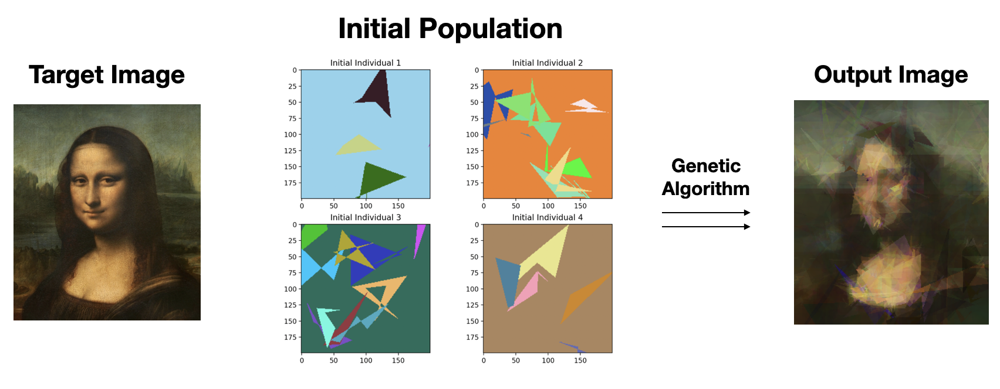

<!-- Improved compatibility of back to top link: See: https://github.com/othneildrew/Best-README-Template/pull/73 -->
<a name="readme-top"></a>

<!-- PROJECT SHIELDS -->
<!--
*** I'm using markdown "reference style" links for readability.
*** Reference links are enclosed in brackets [ ] instead of parentheses ( ).
*** See the bottom of this document for the declaration of the reference variables
*** for contributors-url, forks-url, etc. This is an optional, concise syntax you may use.
*** https://www.markdownguide.org/basic-syntax/#reference-style-links
-->
<!-- [![Contributors][contributors-shield]][contributors-url]
[![Forks][forks-shield]][forks-url]
[![Stargazers][stars-shield]][stars-url]
[![Issues][issues-shield]][issues-url]
[![MIT License][license-shield]][license-url]
[![LinkedIn][linkedin-shield]][linkedin-url] -->


<!-- PROJECT LOGO -->
<br />
<div align="center">
  <a href="https://github.com/othneildrew/Best-README-Template">
    
  </a>

  <h3 align="center">Genetic Algorithm for Image Recreation</h3>

  

  <p align="center">
    A from scratch Python implementation of a genetic algorithm that recreates a target image. 
    <br />
    <!-- <a href="https://github.com/othneildrew/Best-README-Template"><strong>Explore the docs »</strong></a>
    <br />
    <br />
    <a href="https://github.com/othneildrew/Best-README-Template">View Demo</a>
    ·
    <a href="https://github.com/othneildrew/Best-README-Template/issues">Report Bug</a>
    ·
    <a href="https://github.com/othneildrew/Best-README-Template/issues">Request Feature</a> -->
  </p>
</div>

<!-- TABLE OF CONTENTS -->
<details open>
  <summary>Table of Contents</summary>
  <ol>
    <li>
      <a href="#introduction-to-genetic-algorithms">Introduction to Genetic Algorithms</a>
      <ul>
        <li><a href="#built-with">Built With</a></li>
      </ul>
    </li>
    <li>
      <a href="#getting-started">Getting Started</a>
    </li>
    <li>
        <a href="#hyperparameters">Hyperparameters</a>
        <ul> 
            <li><a href="#initial-population">Initial Population</a></li>
            <li><a href="#initial-population">Fitness Function</a></li>
                <ul>
                    <li><a href="#euclidean-distance">Euclidean Distance</a></li>
                    <li><a href="#delta-e">Delta_E</a></li>
                </ul>
            <li><a href="#selection">Selection</a></li>
            <li><a href="#crossover">Crossover</a></li>
                <ul>
                    <li><a href="#crossover-1---blending">Crossover 1 - Blending</a></li>
                    <li><a href="#crossover-2---crossover-point">Crossover 2 - Crossover Point</a></li>
                    <li><a href="#crossover-3---pixel-wise">Crossover 3 - Pixel-Wise</a></li>
                </ul>
            <li><a href="#mutation">Mutation</a></li>
                <ul>
                    <li><a href="#mutation-1---random-shape">Mutation 1 - Random Shape</a></li>
                    <li><a href="#mutation-2---adding-a-constant">Mutation 2 - Adding a Constant</a></li>
                </ul>
        </ul>
    </li>
    <li><a href="#experimentation">Experimentation</a></li>
    <li><a href="#results">Results</a></li>
  </ol>
</details>

<p>

<!-- ABOUT THE PROJECT -->
## Introduction to Genetic Algorithms

<!-- [![Product Name Screen Shot][product-screenshot]](https://example.com) -->

In this section, I give a general overview of what a genetic algorithm is. Readers that are familiar with this concept can skip to the next section. 

A genetic algorithm is an optimization tool inspired by Darwin's theory of evolution. The algorithm mimics the process of natural selection, which chooses the fittest individuals from a population to create offspring and populate future generations. 

A genetic algorithm consists of the main components below. Click on any of the triangles to read a definition of each. 

<ul style="list-style: none;">
 <li>
    <details>
        <summary>Initial Population</summary>
        The genetic algorithm starts with a group of individuals, referred to as the initial population. Each individual is a solution for the target that we are optimizing for. Typically, the individuals of the initial population are created randomly, assuming no prior knowledge about the solution. Because the individuals of the initial population are created randomly, they are likely poor solutions. However, their sole purpose is to serve as the building blocks for future generations.
    </details>
  </li>
  <li>
    <details>
        <summary>Fitness Function</summary>
        Once an initial population is created, the individuals are evaluated based on a fitness function. The fitness function is  a metric that evaluates what our genetic algorithm is seeking to optimize. In the classic genetic algorithm example of binary strings with a target, this fitness function might be how many binary strings have the correct value. In this case, a higher fitness function is a string that is "more fit" and closer to the optimal value.
    </details>
  </li>
   <li>
    <details>
        <summary>Selection Criteria</summary>
        The selection criteria determines which individuals from the population are chosen to be parents for the next generation. Typically, we want to select individuals with stronger fitness. However, if we only select individuals with very strong fitness, we will lose some biodiversity. In terms of our algorithm, we want to maintain a certain level of stochasticity within each population to avoid falling into local minima. The classic way parent selection is done is via tournament selection. In essence, X individuals are selected from the total population and the most fit individual from those X tournament participants is chosen to be the parent. We can see that the lower X is, the more stochasticity and biodiversity we introduce into our parent selection. Finding the optimal balance between selecting generally more fit individuals while also maintaining a diverse set of parents is one of the challenging but fun aspects of genetic algorithms.
    </details>
  </li>
  <li>
    <details>
        <summary>Crossover</summary>
        The crossover methods we implement determine how the offspring are created once we have selected parents. Typically two parents are chosen to create offspring. The purpose of a crossover function is to try to combine the attributes of the two parents into a child that is more fit. In order to do so, a popular method is simply to take the first half of parent(1) and combine it with the second half of parent(2). A random "crossover point" can also be used, meaning that parent(1) is used up until the crossover point and then parent(2) is used after the crossover point. Regardless of how crossover is implemented, the hope is that the child will incorporate elements of both parents and have a higher fitness.
    </details>
  </li>
  <li>
    <details>
        <summary>Mutation</summary>
        Mutations are relatively low probability operations that slightly alter an offspring. The purpose of mutations are to introduce stochasticity, which can help combat local optima.
    </details>
  </li>
</ul>

Putting together these components, we have the foundation for a genetic algorithm. We combine them in the following order. First, an initial population is seeded. It's individuals are evaluated by the fitness function, and then our selection criteria chooses fit parents to crossover and populate the next population. Each time a child is produced, there is a potential it will mutate. 

We can repeat the process of creating future generations for a set number of generations or until an optimal solution is achieved. 

Now that we have introduced a genetic algorithm, we can dive into my genetic algorithm that seeks to recreate an image.

<!-- <p align="right">(<a href="#readme-top">back to top</a>)</p> -->


### Built With

* [![Python][Python]][Python-url]

Using the following libraries:

* [Pillow](https://pillow.readthedocs.io/en/stable/index.html) (Image manipulation)
* [Matplotlib](https://matplotlib.org/) (Image display)
* [Numpy](https://numpy.org/) (Perform vectorized image manipulation and calculations)
* [Colour](https://colour.readthedocs.io/en/latest/index.html) (Delta E color difference calculations)

<!-- <p align="right">(<a href="#readme-top">back to top</a>)</p> -->


<!-- GETTING STARTED -->
## Getting Started

The first step is installing the necessary libraries. This can be done by running the following:

```
pip3 install -r requirements.txt
```

Getting started with the genetica algorithm is as simple as instantiating a GP class from GP.py as the following:

``` 
gp = GP(r"target_image.png")
fittest = gp.run_gp(100, 500)
plt.imshow(fittest.image)
plt.show()
```

The arguments of the `run_gp` method are `(size of the initial population, number of generations to run)`. For most of my experiments, an initial population of size 100 and 5,000 generations was enough to produce great results. By vectorizing the majority of the image manipulations, I am able to run those settings comfortably on my laptop with a run-time of several minutes. 

<!-- USAGE EXAMPLES -->
## Hyperparameters

When tuning hyperparameters, the variables of interest are the following:

* Initial Population
  * Size of the initial population
  * The lower and upper bound on the number of random shapes
* Fitness Function
  * Whether to use Delta_E or Euclidean Distance
* Selection
  * Altering the size of a tournament
* Crossover
  * Different probabilistic combinations
* Mutation
  * Varying the probability of a mutation occurring
  * Changing the probability of using mutation 1 versus mutation 2

We will now dive into the code to change each of the following hyperparameters.

### Initial Population

Changing the size of the initial population can be done by the first argument passed into the `GP` class' `GP.run_gp` method. 

Each individual is created by the `Individual` class found in `Individual.py`. When a random individual is created, it is given a random background color. Then, a random number of polygons of random sides with random color is added onto that background. 

All of this is within the Individual's `create_random_image_array` method. 

```
def create_random_image_array(self):

    # number of polygons to add to image
    iterations = random.randint(3, 6)

    region = (self.l + self.w)//8
    img = Image.new("RGBA", (self.l, self.w), self.rand_color())

    # number of points for each polygon
    for i in range(iterations):
        num_points = random.randint(3, 6)

        ...
```

Below are examples of individuals created this way. 

<div align="center">
    
</div>

### Fitness Function

I experimented with two main fitness functions. The fitness function is found within the `Individual` class. 

#### Euclidean Distance

 A relatively straightforward implementation where I take the Euclidean distance between the RGB values of two pixels. Then, I perform this operation across the entire image and take the mean. To use Euclidean distance:

```
def get_fitness(self, target):
    diff_array = np.subtract(np.array(target), self.array)
    self.fitness = np.mean(np.absolute(diff_array))
```

However, Euclidean distance has one main disadvantage. It is the fact that our eyes do not perceive difference in RGB values according to Euclidan distance. The example below illustrates this. 

<div align="center">
    
</div>

In an attempt to quantify how human eyes detect differences in color, scientists devised the [Delta_E](http://zschuessler.github.io/DeltaE/learn/) metric. 

#### Delta E

Delta_E is a more robust measurement of color difference true to the human eye. It was developed by the International Commission on Illumination and is considered the standard color difference measurement tool. To use the Delta_E fitness function, we simply leverage the colour library in the following manner:

```
def get_fitness(self, target):
    self.fitness = np.mean(colour.difference.delta_e.delta_E_CIE1976(target, self.array))
```

My experiments indicated that Delta_E generated better outputs virtually every single time.


### Selection

I implemented tournament selection to select parents. I randomly sampled the population given a tournament size and selected the fittest individual to be the winner of the tournament. 

```    
def tournament_select(self, population):
    tournament_size = 6
    indices = np.random.choice(len(population), tournament_size)
    random_subset = [population[i] for i in indices]
    ...
```

To experiment with different tournament sizes, alter the `tournament_size` variable. I had the most success with a tournament size between 6-8% of the total population size. 

### Crossover

I implemented 3 unique crossover functions and experimented with probabilistic blends of all 3. Below, I describe each crossover function and give an example.

#### Crossover 1 - Blending

In this functon, I assign opacity $x$ to $\text{parent}_{1}$ and assign opacity $1-x$ to $\text{parent}_{2}$. Then we overlay both of them to create the child. If $x$ is 0, a copy of $\text{parent}_{1}$ is produced. If $x$ is 1, a copy of $\text{parent}_{2}$ is produced.

To determine $x$, I sample a uniform distribution where $x \in (0,1)$. One advantage of not fixing $x = 0.5$ is that this introduces stochasticity to the crossover function and can produce different children given the same parents.

```
def crossover(self, ind1, ind2):
        child = Individual(self.l, self.w)

        # random float between 0 and 1 
        blend_alpha = random.random()

        child.image = Image.blend(ind1.image, ind2.image, blend_alpha)
        child.array = np.array(child.image)
        child.get_fitness(self.target_image)
        return child
```

Below is an example of what this look like:
<div align="center">
    
</div>

#### Crossover 2 - Crossover Point

In this approach, we select a random row or column  to be a crossover point. Everything up until that row or column is from $\text{parent}_{1}$ and everything including and after that row or column is from $\text{parent}_{2}$. Once again, this row or column is selected from a uniform distribution. The two examples below illustrate a row crossover point and a column crossover point respectively. 

<div align="center">
    
</div>

<div align="center">
    
</div>

I assigned an equal chance for Crossover 2 to be done horizontally or vertically. It would be interesting to test diagonal crossover lines but for my experiments, I only used horizontal or vertical crossovers.

```
def crossover_2(self, ind1, ind2, horizontal_prob):

        rand = random.random()

        # perform horizontal crossover point 
        if rand <= horizontal_prob:

            split_point = random.randint(1, self.w)
            
            first = np.ones((split_point, self.l))
            first = np.vstack((first, np.zeros((self.w-split_point, self.l))))

        # perform vertical crossover point 
        else:
            split_point = random.randint(1, self.l)
        
            first = np.ones((self.w, split_point))
            first = np.hstack((first, np.zeros((self.w, self.l-split_point))))
            
        second = 1 - first

        # Creates the 4 dimensional versions to perform the mutliplying across all color channels 
        first = np.dstack([first,first,first,first])
        second = np.dstack([second,second,second,second])

        half_chromo_1 = np.multiply(first, ind1.array)
        half_chromo_2 = np.multiply(second, ind2.array)
        
        child_array = np.add(half_chromo_1, half_chromo_2)
        ...
```

#### Crossover 3 - Pixel-Wise

For this crossover function, each pixel in the child is selected randomly from either $\text{parent}_{1}$ or $\text{parent}_{2}$.

```
    def crossover_3(self, ind1, ind2):
        first = np.random.randint(2, size=(self.w, self.l, 4))
        
        second = 1 - first
    
        half_chromo_1 = np.multiply(first, ind1.array)
        half_chromo_2 = np.multiply(second, ind2.array)
        
        child_array = np.add(half_chromo_1, half_chromo_2)
        ...
```

This technique performs well but ends up creating images that look granulated as you can see in the example below. As a result, I didn't utilize this crossover function much. 

<div align="center">
    
</div>

### Mutation

I developed 2 different mutation functions that would slightly modify an individual. 

#### Mutation 1 - Random Shape

To perform this mutation, I superimpose a random number of shapes of random color onto an individual.

```
def mutate(self, ind):

        # number of random shapes to add 
        iterations = random.randint(1, 1)
        region = random.randint(1,(self.l + self.w)//4)

        img = ind.image

        for i in range(iterations):
            num_points = random.randint(3, 6)
            region_x = random.randint(0, self.l)
            region_y = random.randint(0, self.w)

            xy = []
            for j in range(num_points):
                xy.append((random.randint(region_x - region, region_x + region),
                           random.randint(region_y - region, region_y + region)))

            img1 = ImageDraw.Draw(img)
            img1.polygon(xy, fill=ind.rand_color())

```

The result of this mutation can be seen below.

<div align="center">
    
</div>

#### Mutation 2 - Adding a Constant

In this mutation, I select a random subset of pixels and add a constant to their RGB values. 

```
def mutate_2(self, ind):
    
    num_pix = 40
    
    for i in range(num_pix):
        x = random.randint(0, self.l-1)
        y = random.randint(0, self.w-1)
        z = random.randint(0, 3)
        
        # alteration to pixels by randomized constant 
        ind.array[x][y][z] = ind.array[x][y][z] + random.randint(-10,10)
```

The results of this kind of mutation can be seen in the figure below.

<div align="center">
    
</div>

It's effects are relatively subtle and did not seem to be an effective mutation operation. It also introduces the effect of "pixelation" which I believe tend to decrease the visually appearance of individuals. 

## Experimentation

Given all this information about how the specific hyperparameters work, you can start to experiment with your own images. As a baseline, I will provide the hyperparameters that worked best for me:

* Initial Population
  * Size of 100 
  * Each with [3, 6] shapes of random color 
* Fitness Function
  * Only Delta_E
* Selection 
  * Tournament size of 6
* Repopulation
  * Crossover
    * Using a probabilistic mix of 30% crossover 1 (blending) and 60% crossover 2 (crossover)
  * Mutation
    * Using a 10% chance for mutation 1 (adding shape)
* Number of generations
  * Anywhere between 5,000 and 10,000 
  
## Results

<div align="center">
    
</div>

<!-- 1. Open a Pull Request -->

<!-- <p align="right">(<a href="#readme-top">back to top</a>)</p> -->

<!-- CONTACT -->
<!-- ## Contact

Your Name - [@your_twitter](https://twitter.com/your_username) - email@example.com

Project Link: [https://github.com/your_username/repo_name](https://github.com/your_username/repo_name) -->

<!-- <p align="right">(<a href="#readme-top">back to top</a>)</p> -->


<!-- ACKNOWLEDGMENTS -->
<!-- ## Acknowledgments

Use this space to list resources you find helpful and would like to give credit to. I've included a few of my favorites to kick things off!

* [Choose an Open Source License](https://choosealicense.com)
* [GitHub Emoji Cheat Sheet](https://www.webpagefx.com/tools/emoji-cheat-sheet)
* [Malven's Flexbox Cheatsheet](https://flexbox.malven.co/)
* [Malven's Grid Cheatsheet](https://grid.malven.co/)
* [Img Shields](https://shields.io)
* [GitHub Pages](https://pages.github.com)
* [Font Awesome](https://fontawesome.com)
* [React Icons](https://react-icons.github.io/react-icons/search)

<p align="right">(<a href="#readme-top">back to top</a>)</p> -->


<!-- MARKDOWN LINKS & IMAGES -->
<!-- https://www.markdownguide.org/basic-syntax/#reference-style-links -->
[contributors-shield]: https://img.shields.io/github/contributors/othneildrew/Best-README-Template.svg?style=for-the-badge
[contributors-url]: https://github.com/othneildrew/Best-README-Template/graphs/contributors
[forks-shield]: https://img.shields.io/github/forks/othneildrew/Best-README-Template.svg?style=for-the-badge
[forks-url]: https://github.com/othneildrew/Best-README-Template/network/members
[stars-shield]: https://img.shields.io/github/stars/othneildrew/Best-README-Template.svg?style=for-the-badge
[stars-url]: https://github.com/othneildrew/Best-README-Template/stargazers
[issues-shield]: https://img.shields.io/github/issues/othneildrew/Best-README-Template.svg?style=for-the-badge
[issues-url]: https://github.com/othneildrew/Best-README-Template/issues
[license-shield]: https://img.shields.io/github/license/othneildrew/Best-README-Template.svg?style=for-the-badge
[license-url]: https://github.com/othneildrew/Best-README-Template/blob/master/LICENSE.txt
[linkedin-shield]: https://img.shields.io/badge/-LinkedIn-black.svg?style=for-the-badge&logo=linkedin&colorB=555
[linkedin-url]: https://linkedin.com/in/othneildrew
[product-screenshot]: images/screenshot.png

[Python]: https://img.shields.io/badge/Python-FFD43B?style=for-the-badge&logo=python&logoColor=blue
[Python-url]: https://www.python.org/
